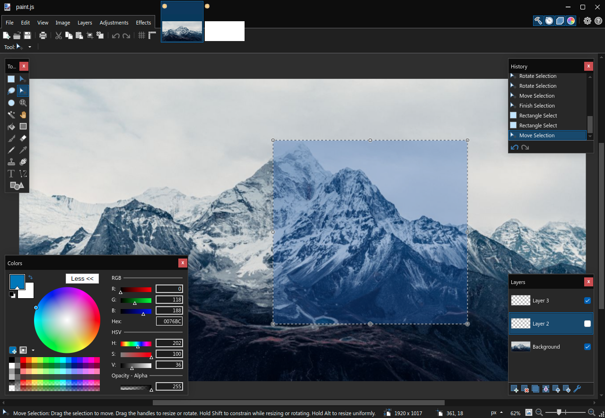
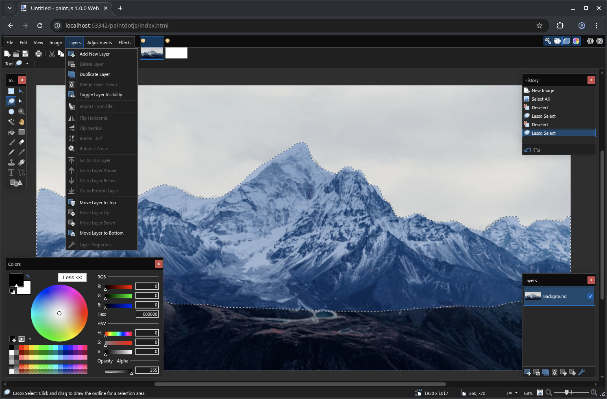

# paint.js

**paint.js** is an open-source raster graphics editor written in **JavaScript**,
ported from **Paint.NET** (v3.36.7) by Rick Brewster, the last version released under the original MIT-compatible license.

### Why?
Paint.NET is arguably the best and simplest painting tool available on Windows.
Since switching to Linux, it has been the program I miss the most and used every day.
The goal of this port is to bring that same experience to macOS, Linux, and the web.

[](LICENSE)

> ⚠️ Note: This project is developed on Chromium and may currently only work correctly in Chromium-based browsers.





---

## Features

The current version includes a fully functional UI and core editing capabilities:

- Full document UI & layout
- Zooming & panning
- Complete edit history with undo/redo
- Document layering system
- Color picker
- Tools window with multiple document support
- Selection tools: lasso, rectangle select
- Transform tools: move, rotate, resize (rectangle selections)

> Note: Rotation of rectangle selections is currently unstable, and performance for large selections is a work in progress.

---

## Getting Started

Follow these steps to get paint.js running locally.

### 1. Download and Extract Assets

paint.js uses the latest assets from **Paint.NET 5.1.9**.  
Due to licensing, these assets **cannot** be included in this repository, so you need to download them yourself:

```bash
python3 scripts/download_assets.py
```

This script will automatically fetch the required assets so the app can run properly.

### 2. Install Dependencies

```bash
npm install
```

### 3. Run the Application

#### Electron Desktop App

```bash
npm run app
```

The Electron version runs as a standalone program, similar to the original Paint.NET application.

#### Web Version

```bash
npm run web-watch
```

Then open `index.html` in your browser. The web version runs as a website, allowing you to use paint.js on any device with a compatible browser.

---

## Development & Contributing

paint.js is reaching a complex stage where performance optimizations and new features are needed.
The current challenge includes:

- Selection transformations: moving and resizing work; rotation is partially broken
- Performance improvements for large selections
- Implementation of additional tools

If you are interested in **contributing**, your help is highly welcome!

---

## License

This project is licensed under the **MIT License**. See the [LICENSE](LICENSE.md) file for details.
