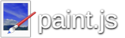

**paint.js** is an unofficial, proof-of-concept, cross-platform **JavaScript** port of the Windows only
raster graphics editor **Paint.NET** by [Rick Brewster](https://www.getpaint.net/). This port is
available for the web and as an Electron desktop application.

Its core editing model is based on **Paint.NET 3.36.7**, the last version released under the original
MIT-compatible license, while the current interface and behavior follow Paint.NET v5.1.12.

## Why?

Paint.NET is one of the best image editors available on Windows, combining powerful features with a
simple, intuitive interface. After switching to Linux, it became the application I missed most and
one I had relied on every day. The goal of paint.js is to bring that familiar editing experience to
Linux, macOS, and the web.

[](LICENSE.md)


## Installation

### Web

Use paint.js directly at [paintjs.net](https://paintjs.net/). No installation is required.

### Arch Linux

Install [`paintdotjs-bin`](https://aur.archlinux.org/packages/paintdotjs-bin) from the AUR with an
AUR helper, for example:

```bash
yay -S paintdotjs-bin
```

During installation, the AUR package fetches the required artwork and translations from the official
Paint.NET download.

### macOS

Download the latest universal `.dmg` from [GitHub Releases](https://github.com/LabyStudio/paintdotjs/releases/latest),
open it, and drag paint.js into the Applications folder.

The macOS app fetches the required artwork and translations from the official Paint.NET download on
first launch.

## Differences from Paint.NET

paint.js is largely feature-complete and closely reproduces the Paint.NET experience, but there are
still some additions and limitations worth noting.

### Added in paint.js

- Runs on macOS, Linux, Windows, and the web through a shared JavaScript codebase, with an Electron
  desktop application for a more native experience.
- A **Fonts** settings page lets you add font files by picker or drag and drop, preview installed
  fonts, and remove individual fonts or clear them all. Added fonts are stored locally and are
  available in the Text tool.
- A searchable **Keyboard** settings page lets you rebind, clear, and reset keyboard shortcuts.
- Interface, canvas, tool, pen, window, and dialog preferences are stored locally and restored across
  sessions.
- The deployed web version can work offline and provides browser-oriented file, clipboard, and drag
  and drop workflows.

### Missing or limited compared with Paint.NET

- Chromium is the supported browser family. Firefox and Safari are not regularly tested, and their
  file-system and clipboard capabilities differ.
- Open Recent, scanner/camera acquisition, and color-profile commands are not implemented yet.
- Native Paint.NET plugins and file-type plugins cannot be loaded.
- Manual GPU/device selection and direct advanced-color management are not implemented.
- Very large documents, large-radius effects, and complex selections may still be slower or more
  memory-intensive than in Paint.NET.
- Some browser functionality requires HTTPS or localhost, including parts of the clipboard,
  file-system, and offline-app support.

## Image formats

| Format | Paint.NET open | Paint.NET save | paint.js open | paint.js save | Important differences |
| --- | :---: | :---: | :---: | :---: | --- |
| Paint.NET (`.pdn`) | Yes | Yes | Limited | Limited | paint.js supports bitmap layers and basic layer properties, with a maximum of 64 layers when saving. History, selections, plugin data, and some newer PDN features are not preserved. |
| PNG | Yes | Yes | Yes | Yes | — |
| JPEG (`.jpg`, `.jpeg`, `.jpe`) | Yes | Yes | Yes | Yes | — |
| JPEG XL (`.jxl`) | Yes | Yes | Yes | Yes | — |
| AVIF | Yes | Yes | Yes | Yes | — |
| HEIC/HEIF | With the Windows codec | With the Windows codec | Yes | No | The bundled paint.js codec can decode these files but cannot encode them. |
| WebP | Yes | Yes | Yes | Yes | — |
| DDS | Yes | Yes | Yes | Yes | paint.js saves uncompressed 32-bit images only. |
| TIFF (`.tif`, `.tiff`) | Yes | Yes | Yes | Yes | paint.js saves uncompressed RGBA images only. |
| GIF | Yes | Yes | Yes | Yes | paint.js saves a single static, palette-based image only. |
| BMP | Yes | Yes | Yes | Yes | paint.js saves 32-bit images with alpha only. |
| TGA | Yes | Yes | Yes | Yes | paint.js saves uncompressed 32-bit images only. |
| JPEG XR (`.jxr`, `.wdp`, `.wmp`) | Yes | Yes | Limited | No | paint.js can open RGB images with 8-bit, 16-bit, or 32-bit floating-point channels but cannot save JPEG XR. |

Animated and multi-page files are imported and exported as a single static image in paint.js.

## Development

Development requires Node.js 22 or newer. Install the dependencies first:

```bash
npm ci
```

### Run the web version

Run the development build in watch mode:

```bash
npm run web-watch
```

In a second terminal, start a local web server and open <http://127.0.0.1:8773/>:

```bash
npx http-server . -p 8773
```

Do not open `index.html` directly from the filesystem because browser security restrictions disable
required functionality.

### Run the Electron app

```bash
npm run app
```

The repository does not redistribute Paint.NET's modern artwork and translations because they are
not part of the MIT-compatible Paint.NET 3.36.7 source release on which this project is based. On the
first build, paint.js fetches the required assets from the official Paint.NET download. This lets the
interface follow Paint.NET v5.1.12 without redistributing those files in this repository.

## License

paint.js is licensed under the [MIT License](LICENSE.md).
