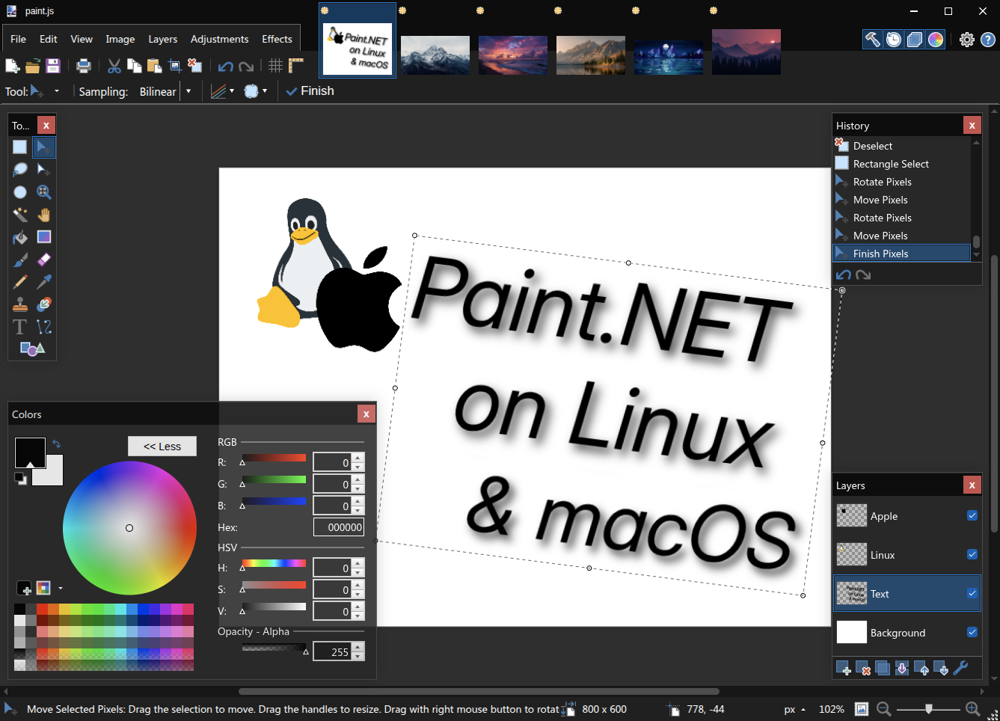
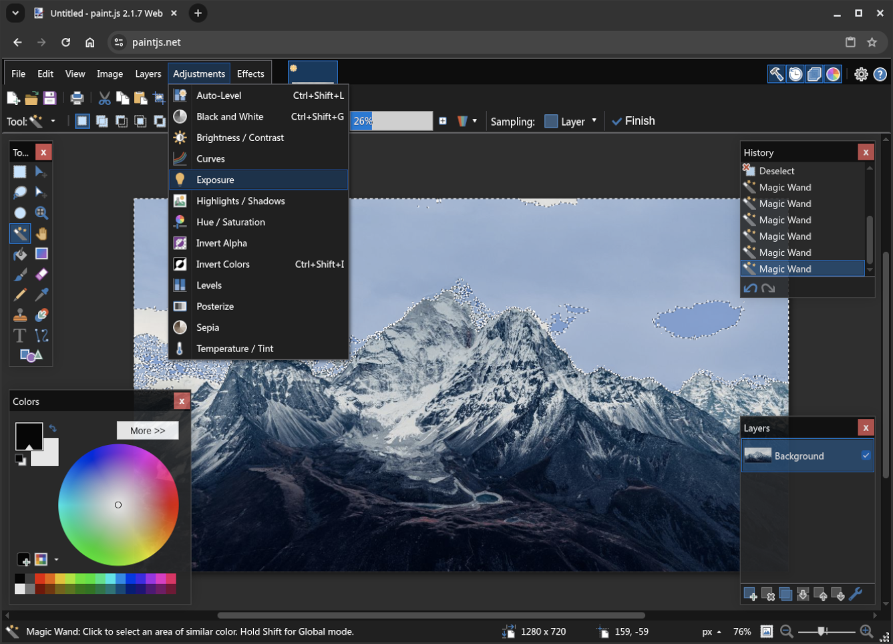

# paint.js

**paint.js** is a cross-platform raster graphics editor for the browser and Electron. It ports the
core editing model of **Paint.NET 3.36.7**, the last version released under an MIT-compatible
license, while recreating much of the interface and behavior of Paint.NET v5+.

The project is independent from Paint.NET. Chromium is the primary target; the Electron desktop app
and Chromium-based browsers currently provide the most complete experience.

[](LICENSE.md)





## Features

### Editing workspace

- Multiple open documents with document tabs, context menus, unsaved-change tracking, and Save All
- Zooming, panning, fit-to-window, actual-size, and zoom-to-selection commands
- Optional pixel grid, rulers, and pixel/inch/centimeter measurements
- Full undo/redo history with a History window
- Clipboard operations for pixels and selection outlines
- Drag and drop images as new documents or layers; the canvas expands when an imported layer is larger
- Image resizing with pixel/print dimensions, DPI, aspect-ratio, percentage, gamma-correct resampling,
  and Paint.NET-style filter controls
- Canvas resizing with synchronized pixel/print dimensions, DPI, nine-point anchoring, and transparent,
  primary, secondary, white, or black fill
- Crop, flatten, flip, and rotate commands for documents and layers
- Browser printing and offline-capable deployed web builds

### Layers

- Add, delete, duplicate, rename, show/hide, reorder, merge down, and flatten
- Layer opacity and Paint.NET-style blend modes
- Import images and `.pdn` documents as layers
- Layers, History, Colors, and Tools windows modeled after the Paint.NET interface

### Tools

All 19 tools in the current toolbox are usable:

- Rectangle, ellipse, lasso, and magic-wand selections
- Move selected pixels and move selection, including resize and rotation handles
- Zoom and pan
- Paint bucket, gradient, paintbrush, eraser, and pencil
- Color picker, clone stamp, and recolor
- Text, line/curve, and shapes

Tool-specific options include brush size, hardness, spacing, pressure, smoothing, antialiasing,
tolerance, sampling mode, fill and blend modes, line caps/dashes, fonts, gradient modes, selection
combining, and rendering quality. Tool defaults and keyboard shortcuts are persisted locally.

The Shapes tool includes the Paint.NET-style grouped picker for basic shapes, polygons and stars,
arrows, callouts, symbols, and a large custom-shape catalog.

### Adjustments and effects

- Adjustments including Auto-Level, Black and White, Brightness/Contrast, Curves, Exposure,
  Highlights/Shadows, Hue/Saturation, Invert Alpha/Colors, Levels, Posterize, Sepia, and
  Temperature/Tint
- Effects grouped under Artistic, Blurs, Color, Distort, Noise, Object, Photo, Render, and Stylize
- Configurable effects use a live preview dialog and integrate with undo/redo
- Rotate/Zoom supports rotation, tilt, panning, zooming, sampling, and tiling

### File support

The combined Save Configuration window lets you choose the format and shows a zoomable encoded
preview with the resulting file size. JPEG also provides quality and chroma-subsampling controls.

| Format | Open | Save | Notes |
| --- | :---: | :---: | --- |
| Paint.NET (`.pdn`) | Yes | Yes | Native PDN3 bitmap layers; currently limited to 1–64 layers |
| PNG | Yes | Yes | Preserves transparency |
| JPEG (`.jpg`, `.jpeg`, `.jpe`) | Yes | Yes | Quality, chroma subsampling, live preview, and file size |
| JPEG XL (`.jxl`) | Yes | Yes | Encoded/decoded with the bundled portable codec |
| AVIF | Yes | Yes | Native browser support is used when available, with a portable fallback |
| HEIC/HEIF | Yes | Yes | Encoded/decoded with the bundled portable codec when needed |
| WebP | Yes | Yes | Quality control; requires browser WebP encoding support |
| DDS | Yes | Yes | Saved as an uncompressed 32-bit surface |
| TIFF (`.tif`, `.tiff`) | Yes | Yes | Saved as an uncompressed RGBA image |
| GIF | Yes | Yes | Static, palette-based image only |
| BMP | Yes | Yes | 32-bit bitmap with alpha |
| TGA | Yes | Yes | Uncompressed 32-bit image |
| JPEG XR (`.jxr`, `.wdp`, `.wmp`) | Yes | Yes | Encoded/decoded with the bundled portable codec |

Saving a layered document to a flat image format asks before flattening it. The flatten operation is
added to history and can be undone. The app also understands the legacy JSON-based paint.js document
format used by older builds.

### Reliability and interface

- Modal dialogs block commands and pointer input in the background
- Application error window displays console errors and stack traces without a native browser alert
- Error recovery includes Copy Error, Ignore, and Save All actions
- Settings for interface colors, animations, canvas appearance, tool defaults, pen input, and shortcuts
- Interface localization with automatic browser-language detection, a manual language selector, and the
  translations shipped with Paint.NET
- Larger slider hit areas and consistent text/icon sizing throughout the interface

## Current limitations

paint.js is usable but is not yet a complete replacement for Paint.NET. Known gaps include:

- Chromium is the supported browser family. Firefox and Safari are not regularly tested, and browser
  file-system/clipboard capabilities differ.
- Open Recent, scanner/camera acquisition, and color-profile commands are visible but not implemented yet.
- Native Paint.NET plugins and file-type plugins cannot be loaded.
- Native `.pdn` support currently covers bitmap layers and their basic properties. It does not preserve
  Paint.NET history, selections, plugin data, or every newer PDN feature, and saving is limited to 64 layers.
- Animated and multi-page formats are imported and exported as a single static image.
- Automatic update checks, manual GPU/device selection, and direct advanced-color management are not
  implemented.
- Very large documents, large-radius effects, and complex selections may still be slow or memory-intensive.
- Some browser security features require HTTPS or localhost, including parts of the clipboard,
  file-system, and PWA functionality.

## Getting started

### Requirements

- Node.js and npm
- Python 3 for downloading the Paint.NET assets and, optionally, serving the web build locally
- A Chromium-based browser for the web version

### 1. Download the assets

paint.js uses interface assets from **Paint.NET 5.1.12**. They cannot be distributed in this
repository, so download them before running the app:

```bash
python3 scripts/download_assets.py
```

The extractor also installs all translations shipped with Paint.NET. To use an existing portable
installation, or to refresh translations without touching image assets, run:

```bash
python3 scripts/download_assets.py \
  --source /path/to/paint.net.portable.x64 \
  --languages-only
```

### 2. Install dependencies

```bash
npm ci
```

### 3. Run the Electron desktop app

```bash
npm run app
```

### 4. Build and run the web app

Build the JavaScript bundle and offline service worker:

```bash
npm run web
```

Serve the repository root over HTTP, then open <http://127.0.0.1:8773/>:

```bash
python3 -m http.server 8773
```

Do not open `index.html` directly from the filesystem: browser security restrictions will prevent
some codecs, file APIs, and PWA behavior from working correctly.

## Development

Run webpack in watch mode while editing:

```bash
npm run web-watch
```

Keep a local HTTP server running in a second terminal. Localhost development deliberately disables
the service worker so stale cached files do not hide source changes.

Other useful commands:

```bash
npm run web       # production web bundle and service worker
npm run pages     # build the GitHub Pages output
npm run dist      # package the Electron application
npm run pwa       # regenerate only the service worker
```

Contributions and focused bug reports are welcome, especially for performance, cross-browser
compatibility, file-format edge cases, and the unimplemented commands listed above.

## License

paint.js is licensed under the [MIT License](LICENSE.md).
